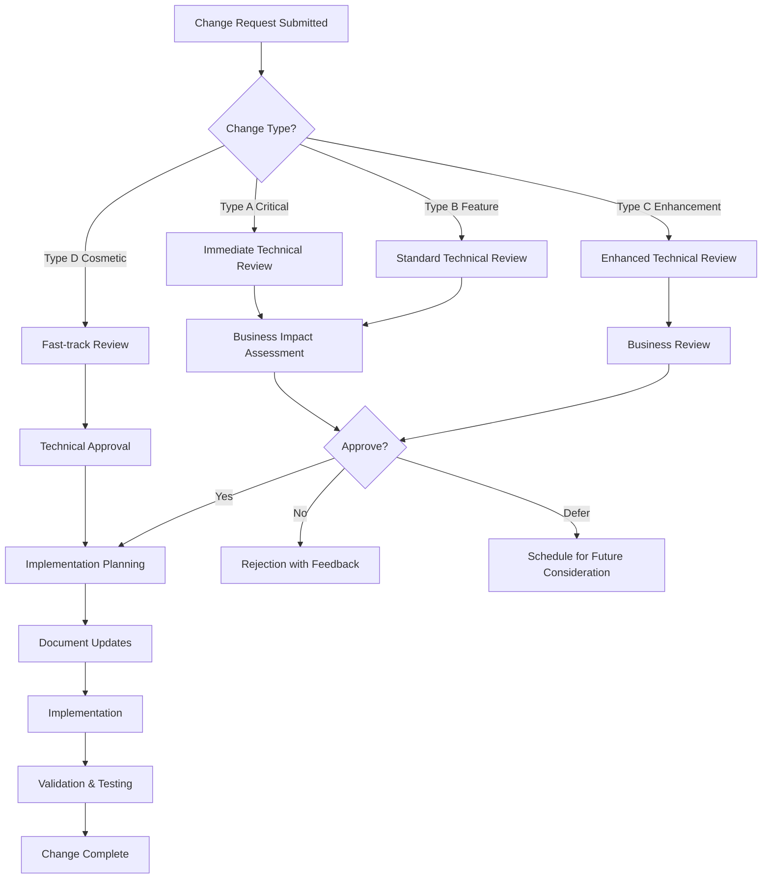

# CupTrack Change Management Framework

## 🎯 Executive Summary

This document establishes a comprehensive change management system for the CupTrack coffee brewing application. It provides structured workflows for handling requirement changes, maintaining document consistency, and ensuring seamless updates across all project components while preserving the 6-month profitability timeline.

---

## 📋 Table of Contents

1. [Change Management Philosophy](#change-management-philosophy)
2. [Change Request Process](#change-request-process)
3. [Impact Assessment Framework](#impact-assessment-framework)
4. [Document Versioning Strategy](#document-versioning-strategy)
5. [Approval Workflow](#approval-workflow)
6. [AI Change Management Guidelines](#ai-change-management-guidelines)
7. [Change Implementation Process](#change-implementation-process)
8. [Rollback Procedures](#rollback-procedures)
9. [Change Communication](#change-communication)
10. [Quality Assurance & Validation](#quality-assurance--validation)

---

## 🎯 Change Management Philosophy

### Core Principles

#### 1. **Controlled Evolution**
- Changes must be systematically evaluated for impact on timeline, scope, and technical architecture
- Every change goes through structured assessment before approval
- No ad-hoc modifications to core requirements without proper analysis

#### 2. **Documentation Consistency**
- All project documents must remain synchronized and consistent
- Changes propagate systematically across all affected documentation
- Cross-references are automatically updated and validated

#### 3. **Timeline Protection**
- Changes must be evaluated against the 6-month profitability goal
- Priority-based approval ensures critical path protection
- Scope adjustments are preferred over timeline extensions

#### 4. **Traceability & Reversibility**
- Complete audit trail of all changes with rationale
- All changes can be rolled back if they create unforeseen problems
- Decision history preserved for future reference

---

## 📝 Change Request Process

### Change Request Types

#### **Type A: Critical Changes** (Require immediate attention)
- Security vulnerabilities or compliance issues
- Technical architecture changes affecting platform integration
- Core business model or revenue stream modifications
- User safety or data privacy concerns

#### **Type B: Feature Changes** (Standard evaluation process)
- New feature requests or feature modifications
- UI/UX design changes
- Database schema modifications
- API endpoint changes or additions

#### **Type C: Enhancement Changes** (Lower priority evaluation)
- Performance improvements
- Code quality improvements
- Documentation enhancements
- Developer experience improvements

#### **Type D: Cosmetic Changes** (Fast-track approval)
- Copy text changes
- Minor styling adjustments
- Help text or tooltip updates
- Non-functional UI polish

### Change Request Submission

#### Change Request Template
```markdown
# Change Request CR-YYYY-MM-DD-XXX

## Basic Information
- **Request ID**: CR-YYYY-MM-DD-XXX
- **Submission Date**: YYYY-MM-DD
- **Requested By**: [Name/Role]
- **Change Type**: [A/B/C/D] - [Brief justification]
- **Priority**: [Critical/High/Medium/Low]

## Change Description
### Current State
[Detailed description of how things work currently]

### Proposed Change
[Detailed description of the proposed change]

### Business Justification
[Why this change is needed - business value, user benefit, technical necessity]

## Impact Assessment (To be completed by reviewer)
### Affected Components
- [ ] spec.md (Product Requirements)
- [ ] design-system.md (UI/UX Design)
- [ ] blueprint.md (Implementation Plan)
- [ ] claude.md (Development Guidelines)
- [ ] todo.md (Project Management)
- [ ] Frontend Code
- [ ] Backend Code
- [ ] Database Schema
- [ ] API Endpoints
- [ ] Third-party Integrations

### Timeline Impact
- **Development Time**: [X hours/days]
- **Testing Time**: [X hours/days]  
- **Documentation Time**: [X hours/days]
- **Total Impact**: [X days]
- **Critical Path Effect**: [Yes/No - Explanation]

### Resource Requirements
- **Development Resources**: [Requirements]
- **Design Resources**: [Requirements]
- **Testing Resources**: [Requirements]
- **External Dependencies**: [Requirements]

## Risk Assessment
### Technical Risks
- [Risk 1]: [Description] - [Mitigation Plan]
- [Risk 2]: [Description] - [Mitigation Plan]

### Business Risks
- [Risk 1]: [Description] - [Mitigation Plan]
- [Risk 2]: [Description] - [Mitigation Plan]

### Timeline Risks
- [Risk 1]: [Description] - [Mitigation Plan]
- [Risk 2]: [Description] - [Mitigation Plan]

## Approval Section
- **Technical Reviewer**: [Name] - [Approve/Reject] - [Date]
- **Business Owner**: [Name] - [Approve/Reject] - [Date]  
- **Project Manager**: [Name] - [Approve/Reject] - [Date]
- **Final Decision**: [Approved/Rejected/Deferred] - [Date]

## Implementation Plan (If Approved)
### Update Sequence
1. [First document/component to update]
2. [Second document/component to update]
3. [Third document/component to update]
[...]

### Testing Plan
- [ ] Unit Tests Updated
- [ ] Integration Tests Updated
- [ ] Documentation Consistency Verified
- [ ] User Acceptance Testing Completed

### Rollback Plan
[Specific steps to revert this change if issues arise]
```

---

## 🔍 Impact Assessment Framework

### Impact Assessment Matrix

#### Documentation Impact Levels

| Level | Description | Documentation Updates Required | Example |
|-------|-------------|-------------------------------|---------|
| **Level 1: Isolated** | Single document update | 1 document | Copy text change |
| **Level 2: Linked** | Multiple related documents | 2-3 documents | Feature specification change |
| **Level 3: Cascading** | Multiple documents + code | 4+ documents + code | New major feature |
| **Level 4: Architectural** | All documents + major code | All documents + architecture | Platform change |

#### Technical Impact Assessment

##### Frontend Impact
```markdown
### Frontend Assessment Checklist
- [ ] Component library changes required?
- [ ] New pages or routes needed?
- [ ] State management changes?
- [ ] API integration changes?
- [ ] UI/UX design system updates?
- [ ] Responsive design considerations?
- [ ] Accessibility impact?
- [ ] Performance implications?
- [ ] Browser compatibility concerns?
- [ ] Testing strategy updates?
```

##### Backend Impact  
```markdown
### Backend Assessment Checklist
- [ ] Database schema changes?
- [ ] New API endpoints required?
- [ ] Authentication/authorization changes?
- [ ] Business logic modifications?
- [ ] Third-party integration updates?
- [ ] Performance implications?
- [ ] Security considerations?
- [ ] Scalability impact?
- [ ] Error handling updates?
- [ ] Testing strategy updates?
```

##### Documentation Impact
```markdown
### Documentation Assessment Checklist
- [ ] spec.md: Requirements change?
- [ ] design-system.md: UI/UX specifications change?
- [ ] blueprint.md: Implementation approach change?
- [ ] claude.md: Development guidelines change?
- [ ] todo.md: Task priorities or scope change?
- [ ] README files need updates?
- [ ] API documentation changes?
- [ ] User documentation updates?
- [ ] Developer onboarding changes?
- [ ] Deployment procedures change?
```

### Automated Impact Analysis

#### Document Dependency Mapping
```javascript
// Document relationship matrix for automated impact analysis
const DOCUMENT_DEPENDENCIES = {
  'spec.md': {
    affects: ['design-system.md', 'blueprint.md', 'todo.md'],
    affectedBy: ['change-management.md'],
    criticalSections: ['User Stories', 'Functional Requirements', 'Technical Architecture']
  },
  'design-system.md': {
    affects: ['blueprint.md', 'claude.md'],
    affectedBy: ['spec.md'],
    criticalSections: ['Component Library', 'Visual Design System', 'User Experience']
  },
  'blueprint.md': {
    affects: ['claude.md', 'todo.md'],
    affectedBy: ['spec.md', 'design-system.md'],
    criticalSections: ['Implementation Steps', 'Technical Requirements', 'Testing Strategy']
  },
  'claude.md': {
    affects: ['todo.md'],
    affectedBy: ['design-system.md', 'blueprint.md', 'change-management.md'],
    criticalSections: ['Development Guidelines', 'Code Standards', 'Testing Requirements']
  },
  'todo.md': {
    affects: [],
    affectedBy: ['spec.md', 'blueprint.md', 'claude.md'],
    criticalSections: ['Task Priorities', 'Timeline', 'Resource Allocation']
  }
};
```

---

## 🏷 Document Versioning Strategy

### Semantic Versioning for Documentation

#### Version Format: `MAJOR.MINOR.PATCH`

- **MAJOR**: Significant requirement changes that affect core functionality or business model
- **MINOR**: New features, significant enhancements, or structural changes
- **PATCH**: Bug fixes, clarifications, minor improvements, cosmetic changes

#### Version Examples
```
1.0.0 - Initial project requirements (Phase 1 complete)
1.1.0 - Added advanced analytics features
1.1.1 - Clarified user journey requirements
1.2.0 - Enhanced UI/UX specifications for mobile
2.0.0 - Major business model change (e.g., added subscription tiers)
```

### Document Version Control

#### Version Header Template
```markdown
---
title: [Document Name]
version: X.Y.Z
last_updated: YYYY-MM-DD
last_updated_by: [Name/AI Session ID]
change_summary: [Brief description of changes in this version]
related_changes: [List of related change request IDs]
document_dependencies: [List of other documents that reference this one]
---
```

#### Version Compatibility Matrix
```markdown
# Document Compatibility Matrix
| Document | Current Version | Compatible With |
|----------|----------------|-----------------|
| spec.md | 1.2.0 | design-system.md v1.1.x, blueprint.md v1.2.x |
| design-system.md | 1.1.3 | spec.md v1.2.x, blueprint.md v1.2.x |
| blueprint.md | 1.2.1 | spec.md v1.2.x, design-system.md v1.1.x |
| claude.md | 1.3.0 | All documents v1.x |
| todo.md | 1.4.2 | Current project state |
```

### Change Tracking Per Document

#### Document Change Log Format
```markdown
## Change History

### Version X.Y.Z (YYYY-MM-DD)
**Change Request**: CR-YYYY-MM-DD-XXX
**Changed By**: [Name/AI Session]
**Impact Level**: [1-4]

#### Changes Made
- [Specific change 1]
- [Specific change 2]
- [Specific change 3]

#### Affected Sections
- Section A: [Description of change]
- Section B: [Description of change]

#### Related Document Updates
- document.md: [What was updated and why]
- another-doc.md: [What was updated and why]

#### Validation Completed
- [ ] Cross-reference consistency checked
- [ ] Technical feasibility validated  
- [ ] Timeline impact assessed
- [ ] Stakeholder notification sent

---
```

---

## ✅ Approval Workflow

### Approval Authority Matrix

| Change Type | Technical Review | Business Review | Final Approval | Timeline |
|-------------|------------------|-----------------|----------------|----------|
| **Type A (Critical)** | Lead Developer | Project Owner | Project Owner | Immediate |
| **Type B (Feature)** | Lead Developer | Product Manager | Project Owner | 2-3 days |
| **Type C (Enhancement)** | Senior Developer | Product Manager | Product Manager | 3-5 days |
| **Type D (Cosmetic)** | Any Developer | N/A | Lead Developer | Same day |

### Approval Process Flow



### Approval Criteria

#### Technical Approval Criteria
- [ ] Change is technically feasible within current architecture
- [ ] No negative impact on platform integration (Vercel ↔ Railway ↔ Supabase)
- [ ] Maintains code quality standards and testing coverage
- [ ] Performance impact is acceptable
- [ ] Security implications are assessed and mitigated
- [ ] Scalability impact is considered
- [ ] Documentation updates are planned and scoped

#### Business Approval Criteria
- [ ] Aligns with 6-month profitability goal
- [ ] Provides measurable user or business value
- [ ] Resource requirements are available and justified
- [ ] Timeline impact is acceptable
- [ ] Risk/benefit analysis is favorable
- [ ] Change supports core business objectives
- [ ] User experience impact is positive or neutral

#### Project Management Approval Criteria
- [ ] Critical path analysis completed
- [ ] Resource allocation is feasible
- [ ] Dependencies are identified and manageable
- [ ] Communication plan is in place
- [ ] Success metrics are defined
- [ ] Rollback plan is comprehensive
- [ ] Testing strategy is adequate

---

## 🤖 AI Change Management Guidelines

### Claude AI Change Handling Protocol

#### Step 1: Change Detection and Analysis
```markdown
When a user requests a requirement change, Claude AI must:

1. **Immediate Assessment**:
   - Identify the type of change (A/B/C/D)
   - Determine which documents will be affected
   - Assess the complexity level (1-4)

2. **Documentation Review**:
   - Read all potentially affected documents
   - Identify cross-references that need updates
   - Check version compatibility requirements

3. **Impact Analysis**:
   - Use the Impact Assessment Framework
   - Complete the appropriate assessment checklist
   - Document potential risks and mitigation strategies
```

#### Step 2: Change Request Creation
```markdown
Claude AI must:

1. **Create Formal Change Request**:
   - Use the standard Change Request Template
   - Fill in all required sections based on analysis
   - Generate unique CR-YYYY-MM-DD-XXX identifier

2. **Present to User**:
   - Explain the scope and impact of the change
   - Present the formal change request for review
   - Recommend approval path based on change type
   - Highlight any concerns or risks identified

3. **Await Approval**:
   - Do NOT implement changes without explicit approval
   - Document the approval status and any conditions
   - Proceed only when all required approvals are obtained
```

#### Step 3: Implementation Sequence
```markdown
When implementing approved changes, Claude AI must follow this sequence:

1. **Documentation Updates** (in order):
   a. spec.md (if requirements change)
   b. design-system.md (if UI/UX changes)
   c. blueprint.md (if implementation approach changes)
   d. claude.md (if development guidelines change)
   e. todo.md (always update with new tasks/priorities)
   f. CHANGELOG.md (document the change)

2. **Cross-Reference Updates**:
   - Update all document cross-references
   - Verify internal links still work
   - Update version compatibility matrix
   - Check document dependency consistency

3. **Code Updates** (if applicable):
   - Frontend changes
   - Backend changes
   - Database schema updates
   - API modifications
   - Test updates

4. **Validation**:
   - Run consistency checks
   - Verify all cross-references
   - Test changed functionality
   - Update relevant tests
```

#### Step 4: Change Completion
```markdown
After implementing changes, Claude AI must:

1. **Update Version Numbers**:
   - Increment versions according to semantic versioning
   - Update version headers in all affected documents
   - Update the compatibility matrix

2. **Document the Change**:
   - Add entry to CHANGELOG.md
   - Update change history in affected documents
   - Update todo.md with completed change tasks

3. **Validate Consistency**:
   - Run automated consistency checks
   - Verify all cross-references are updated
   - Confirm no contradictions exist between documents

4. **Report Completion**:
   - Provide summary of all changes made
   - Confirm all requirements from change request are met
   - Highlight any additional changes that were required
   - Document any issues encountered and how they were resolved
```

### AI Decision-Making Guidelines

#### When to Seek Human Approval
Claude AI must seek human approval for:
- Any Type A (Critical) changes
- Changes that affect the 6-month timeline
- Changes that require new resources or budget
- Changes that conflict with existing approved requirements
- Changes that have potential security or privacy implications
- Changes that affect third-party integrations or contracts

#### When AI Can Proceed Independently
Claude AI can implement immediately:
- Type D (Cosmetic) changes that are clearly beneficial
- Bug fixes in documentation (factual errors, broken links)
- Formatting improvements and consistency fixes
- Clarifications that don't change meaning
- Cross-reference updates when documents are restructured

#### Error Handling and Recovery
If Claude AI makes an error during change implementation:
1. **Immediate Stop**: Halt all further changes
2. **Assess Damage**: Identify what was incorrectly changed
3. **Rollback Plan**: Use the documented rollback procedure
4. **Report Issue**: Document the error and corrective actions
5. **Prevent Recurrence**: Update guidelines to prevent similar errors

---

## 🔄 Change Implementation Process

### Implementation Phases

#### Phase 1: Pre-Implementation Validation
```markdown
Before making any changes:

1. **Final Approval Check**:
   - Verify all required approvals are obtained
   - Confirm change request details haven't changed
   - Check for any new dependencies or conflicts

2. **Environment Preparation**:
   - Create backup of current documentation state
   - Ensure all tools and systems are accessible
   - Verify no other changes are in progress

3. **Implementation Planning**:
   - Review the approved implementation sequence
   - Identify potential conflict points
   - Prepare rollback procedures
```

#### Phase 2: Core Implementation
```markdown
During implementation:

1. **Follow Approved Sequence**:
   - Update documents in the specified order
   - Make changes incrementally and systematically
   - Test changes as you implement them

2. **Maintain Change Log**:
   - Document each change as it's made
   - Note any deviations from the plan
   - Record time stamps for all changes

3. **Continuous Validation**:
   - Check cross-references after each document update
   - Verify consistency between documents
   - Test any functional changes immediately
```

#### Phase 3: Post-Implementation Validation
```markdown
After implementation is complete:

1. **Comprehensive Review**:
   - Review all changed documents for consistency
   - Verify all cross-references are updated
   - Check that version numbers are incremented properly

2. **Integration Testing**:
   - Test any functional changes
   - Verify platform integrations still work
   - Run automated tests if applicable

3. **Documentation Completion**:
   - Update CHANGELOG.md with detailed change record
   - Update todo.md with completed tasks
   - Generate change completion report
```

### Implementation Best Practices

#### Document Update Order Priority
1. **spec.md** - Always update first if requirements change
2. **design-system.md** - Update second if UI/UX changes
3. **blueprint.md** - Update third if implementation approach changes
4. **claude.md** - Update fourth if development guidelines change
5. **todo.md** - Always update last to reflect new project state
6. **CHANGELOG.md** - Update during implementation to track changes

#### Cross-Reference Management
```markdown
When updating cross-references:

1. **Search for References**:
   - Use find/search to locate all references to changed content
   - Check both explicit links and contextual references
   - Verify external references (to other documents)

2. **Update Systematically**:
   - Update direct references first
   - Then update contextual references
   - Finally check for implicit dependencies

3. **Validate Updates**:
   - Test all links to ensure they work
   - Verify context still makes sense
   - Check for orphaned references
```

---

## ⏪ Rollback Procedures

### Rollback Triggers

#### Automatic Rollback Scenarios
- Critical system failures after implementation
- Data corruption or loss
- Security vulnerabilities introduced
- Complete platform integration failure
- Critical business logic errors

#### Manual Rollback Scenarios
- User acceptance testing failure
- Performance degradation beyond acceptable limits
- Unforeseen conflicts with other system components
- Stakeholder rejection after implementation
- Timeline impact exceeds approved limits

### Rollback Process

#### Immediate Rollback (Critical Issues)
```markdown
For critical issues requiring immediate rollback:

1. **Stop All Further Changes** (0-5 minutes):
   - Halt any ongoing implementation work
   - Document current state and issue encountered
   - Notify all stakeholders of rollback initiation

2. **Assess Rollback Scope** (5-15 minutes):
   - Identify all changes made since last stable state
   - Determine minimum rollback needed to resolve issue
   - Check for any changes that can't be rolled back

3. **Execute Rollback** (15-60 minutes):
   - Restore documents from backup (if available)
   - OR manually revert changes in reverse order
   - Test system stability after each major reversion

4. **Validate Rollback** (15-30 minutes):
   - Verify system functionality is restored
   - Check that all documents are consistent
   - Confirm platform integrations are working

5. **Document Incident** (30-60 minutes):
   - Create detailed incident report
   - Document root cause analysis
   - Update rollback procedures if needed
   - Plan corrective actions for next attempt
```

#### Planned Rollback (Non-Critical Issues)
```markdown
For planned rollbacks due to non-critical issues:

1. **Rollback Planning** (1-4 hours):
   - Analyze what needs to be reverted
   - Plan rollback sequence to minimize impact
   - Notify stakeholders of planned rollback
   - Schedule rollback window

2. **Execute Planned Rollback** (30 minutes - 2 hours):
   - Follow planned rollback sequence
   - Document each step for future reference
   - Test system stability throughout process
   - Validate functionality after completion

3. **Post-Rollback Analysis** (1-2 hours):
   - Analyze why change needed to be rolled back
   - Document lessons learned
   - Update change process if needed
   - Plan improved approach for future attempt
```

### Rollback Prevention

#### Pre-Implementation Risk Mitigation
- Comprehensive impact analysis before changes
- Staged implementation with validation points
- Backup procedures for all critical documents
- Clear success criteria and validation steps
- Stakeholder sign-off on implementation plan

#### Implementation Safeguards
- Incremental changes with testing at each step
- Continuous validation during implementation
- Real-time monitoring of system health
- Clear checkpoints for go/no-go decisions
- Immediate rollback triggers for critical issues

---

## 📢 Change Communication

### Stakeholder Communication Matrix

| Stakeholder | Type A Changes | Type B Changes | Type C Changes | Type D Changes |
|-------------|----------------|----------------|----------------|----------------|
| **Project Owner** | Immediate notification | Within 24 hours | Weekly summary | Monthly summary |
| **Development Team** | Immediate notification | Within 2 hours | Daily standup | Weekly summary |
| **Product Manager** | Immediate notification | Within 4 hours | Weekly summary | Monthly summary |
| **QA Team** | Immediate notification | Within 2 hours | Next day | Weekly summary |
| **Users/Beta Testers** | As appropriate | Feature announcements | Not typically | Not typically |

### Communication Templates

#### Change Notification Template
```markdown
Subject: [URGENT/IMPORTANT/INFO] Change Request CR-YYYY-MM-DD-XXX [Status]

## Change Summary
**Change ID**: CR-YYYY-MM-DD-XXX
**Change Type**: [A/B/C/D] - [Description]
**Status**: [Submitted/Under Review/Approved/Rejected/In Progress/Complete]
**Timeline Impact**: [X days/No impact]

## What's Changing
[Brief description of what will be different]

## Why This Change
[Business justification or technical necessity]

## Impact on You
**Development Team**: [Specific impact and actions needed]
**QA Team**: [Testing requirements and timeline]
**Product Team**: [Feature or requirement changes]
**Users**: [User-facing changes, if any]

## Timeline
- **Planned Start**: [Date]
- **Expected Completion**: [Date]
- **Testing Complete**: [Date]
- **Go-Live**: [Date]

## Questions or Concerns
Contact [Name] for technical questions or [Name] for business questions.
```

#### Change Status Update Template
```markdown
Subject: Change Update - CR-YYYY-MM-DD-XXX - [Current Status]

## Progress Update
**Change**: [Brief description]
**Status**: [Current status]
**Progress**: [X% complete or specific milestone reached]

## Completed This Period
- [Task 1 completed]
- [Task 2 completed]
- [Task 3 completed]

## Next Steps
- [Next task to be completed]
- [Following task after that]
- [Final validation/testing steps]

## Issues or Blockers
[Any issues encountered or None]

## Revised Timeline (if applicable)
[Any changes to expected completion dates]
```

#### Change Completion Notification
```markdown
Subject: COMPLETE - Change Request CR-YYYY-MM-DD-XXX Successfully Implemented

## Change Completed Successfully
**Change**: [Description]
**Completion Date**: [Date]
**Implementation Time**: [Actual time taken]

## What Was Delivered
- [Deliverable 1]: [Description]
- [Deliverable 2]: [Description]
- [Deliverable 3]: [Description]

## Validation Results
- **Functionality Testing**: ✅ Passed
- **Integration Testing**: ✅ Passed
- **Performance Testing**: ✅ Passed
- **Documentation Updated**: ✅ Complete

## What This Means for You
[Specific implications for different stakeholder groups]

## Next Steps
[Any follow-up actions required]

## Feedback
Please report any issues or feedback to [Contact].
```

---

## 🔍 Quality Assurance & Validation

### Change Validation Framework

#### Pre-Implementation Validation
```markdown
Before implementing any change:

1. **Requirements Validation**:
   - [ ] Change request is complete and clear
   - [ ] All required approvals are obtained
   - [ ] Business justification is sound
   - [ ] Technical feasibility is confirmed

2. **Impact Validation**:
   - [ ] All affected documents identified
   - [ ] Cross-reference impacts mapped
   - [ ] Timeline impacts calculated
   - [ ] Resource requirements confirmed

3. **Risk Validation**:
   - [ ] Technical risks identified and mitigated
   - [ ] Business risks assessed and acceptable
   - [ ] Rollback procedures prepared and tested
   - [ ] Success criteria clearly defined
```

#### Implementation Validation
```markdown
During implementation:

1. **Incremental Validation**:
   - [ ] Each document update reviewed before proceeding
   - [ ] Cross-references updated and tested
   - [ ] Version numbers incremented correctly
   - [ ] Change log updated continuously

2. **Consistency Validation**:
   - [ ] No contradictions between documents
   - [ ] Technical specifications remain coherent
   - [ ] Business requirements still aligned
   - [ ] Timeline and scope remain realistic

3. **Quality Validation**:
   - [ ] Writing quality maintained
   - [ ] Technical accuracy verified
   - [ ] Formatting consistency preserved
   - [ ] Links and references functional
```

#### Post-Implementation Validation
```markdown
After implementation is complete:

1. **Comprehensive Review**:
   - [ ] All changed documents reviewed for quality
   - [ ] Cross-references validated across all documents
   - [ ] Version compatibility verified
   - [ ] Change log completeness confirmed

2. **Functional Validation**:
   - [ ] Any code changes tested
   - [ ] Integration points verified
   - [ ] Performance impact assessed
   - [ ] Security implications reviewed

3. **Process Validation**:
   - [ ] Change process followed correctly
   - [ ] All required documentation updated
   - [ ] Stakeholder communication completed
   - [ ] Lessons learned documented
```

### Automated Validation Tools

#### Document Consistency Checker
```bash
#!/bin/bash
# Basic consistency validation script

echo "Checking document consistency..."

# Check for broken internal links
echo "Checking internal links..."
grep -r "\[.*\](.*\.md)" *.md | while read line; do
    file=$(echo $line | cut -d: -f1)
    link=$(echo $line | grep -o '\[.*\](.*\.md)' | sed 's/.*(\(.*\))/\1/')
    if [ ! -f "$link" ]; then
        echo "BROKEN LINK in $file: $link"
    fi
done

# Check version consistency
echo "Checking version headers..."
for file in *.md; do
    if grep -q "^version:" "$file"; then
        version=$(grep "^version:" "$file" | cut -d: -f2 | tr -d ' ')
        echo "$file: $version"
    else
        echo "WARNING: No version header in $file"
    fi
done

# Check for orphaned references
echo "Checking for potential orphaned references..."
grep -r "TODO\|FIXME\|XXX" *.md | head -10

echo "Consistency check complete."
```

#### Cross-Reference Validation
```python
#!/usr/bin/env python3
"""
Document cross-reference validation tool
"""

import re
import os
import glob

def find_cross_references():
    """Find all cross-references between documents."""
    references = {}
    
    for file_path in glob.glob("*.md"):
        with open(file_path, 'r') as f:
            content = f.read()
            
        # Find references to other documents
        refs = re.findall(r'\[.*?\]\((.*?\.md.*?)\)', content)
        references[file_path] = refs
    
    return references

def validate_references(references):
    """Validate that all references point to existing files/sections."""
    errors = []
    
    for source_file, refs in references.items():
        for ref in refs:
            # Extract filename (before any # anchor)
            target_file = ref.split('#')[0]
            
            if target_file and not os.path.exists(target_file):
                errors.append(f"BROKEN REFERENCE in {source_file}: {ref}")
    
    return errors

def main():
    print("Validating document cross-references...")
    references = find_cross_references()
    errors = validate_references(references)
    
    if errors:
        print("ERRORS FOUND:")
        for error in errors:
            print(f"  {error}")
        return 1
    else:
        print("All cross-references validated successfully.")
        return 0

if __name__ == "__main__":
    exit(main())
```

### Quality Gates

#### Change Approval Quality Gates
- [ ] Impact assessment completeness score > 90%
- [ ] All required approvals obtained
- [ ] Risk mitigation plans for all identified risks
- [ ] Rollback procedure documented and feasible
- [ ] Success criteria quantifiable and testable

#### Implementation Quality Gates
- [ ] All affected documents updated
- [ ] Cross-reference consistency maintained
- [ ] Version numbers properly incremented
- [ ] Change log entries complete and accurate
- [ ] No broken links or references

#### Completion Quality Gates
- [ ] All validation checks passed
- [ ] Stakeholder communication completed
- [ ] Post-implementation testing successful
- [ ] Documentation quality maintained
- [ ] Process lessons learned documented

---

## 📊 Change Metrics & Monitoring

### Key Performance Indicators

#### Change Process Efficiency
- **Average Change Processing Time**: Target < 3 days for Type B changes
- **Change Approval Rate**: Target > 80% first-time approval
- **Rollback Rate**: Target < 5% of implemented changes
- **Documentation Consistency Score**: Target > 95%

#### Change Impact Tracking
- **Timeline Impact**: Total days added/subtracted from project timeline
- **Resource Utilization**: Hours spent on change implementation vs. original development
- **Scope Drift**: Percentage of original requirements that have changed
- **Change Request Volume**: Number of changes per week/month

#### Quality Metrics
- **Documentation Quality Score**: Based on consistency, completeness, accuracy
- **Cross-Reference Accuracy**: Percentage of links/references that are valid
- **Version Control Compliance**: Percentage of changes with proper versioning
- **Stakeholder Satisfaction**: Feedback scores on change communication and implementation

### Change Analytics Dashboard

#### Weekly Change Report Template
```markdown
# Weekly Change Management Report - Week of [Date]

## Summary Statistics
- **Changes Submitted**: [X] (Type A: [X], Type B: [X], Type C: [X], Type D: [X])
- **Changes Approved**: [X] ([X]% approval rate)
- **Changes Implemented**: [X]
- **Changes Rolled Back**: [X]
- **Average Processing Time**: [X] days

## Timeline Impact
- **Days Added to Timeline**: [X]
- **Days Saved from Timeline**: [X]
- **Net Timeline Impact**: [+/-X] days
- **Critical Path Changes**: [X]

## Documentation Health
- **Documents Updated This Week**: [List]
- **Version Changes**: [List of version increments]
- **Consistency Score**: [X]%
- **Cross-Reference Accuracy**: [X]%

## Top Change Categories
1. [Category]: [X] changes
2. [Category]: [X] changes
3. [Category]: [X] changes

## Issues and Improvements
### Issues Encountered
- [Issue 1]: [Description and resolution]
- [Issue 2]: [Description and resolution]

### Process Improvements Made
- [Improvement 1]: [Description and impact]
- [Improvement 2]: [Description and impact]

### Recommendations for Next Week
- [Recommendation 1]: [Rationale]
- [Recommendation 2]: [Rationale]
```

#### Monthly Change Analytics
```markdown
# Monthly Change Management Analytics - [Month Year]

## Trend Analysis
### Change Volume Trends
- Total Changes: [X] (vs. [X] last month)
- Change Rate: [X] changes per week
- Most Active Change Category: [Category]

### Processing Efficiency Trends  
- Average Processing Time: [X] days (vs. [X] last month)
- Approval Rate: [X]% (vs. [X]% last month)
- Rollback Rate: [X]% (vs. [X]% last month)

### Timeline Impact Analysis
- Cumulative Timeline Impact: [+/-X] days
- Major Timeline Changes: [List]
- Critical Path Modifications: [X]

## Quality Metrics
### Documentation Quality
- Overall Consistency Score: [X]% (vs. [X]% last month)
- Cross-Reference Accuracy: [X]% (vs. [X]% last month)
- Version Control Compliance: [X]% (vs. [X]% last month)

### Stakeholder Satisfaction
- Communication Satisfaction: [X]/10
- Change Quality Satisfaction: [X]/10
- Process Satisfaction: [X]/10

## Lessons Learned
### Most Effective Practices
1. [Practice]: [Why it worked well]
2. [Practice]: [Why it worked well]

### Areas for Improvement
1. [Area]: [What needs to improve and how]
2. [Area]: [What needs to improve and how]

### Process Evolution
- [Process Change]: [Why it was made and impact]
- [Process Change]: [Why it was made and impact]
```

---

## 🔄 Continuous Improvement

### Process Evolution

#### Monthly Process Review
Every month, conduct a comprehensive review of the change management process:

1. **Analyze Metrics**: Review all KPIs and trend data
2. **Gather Feedback**: Collect input from all stakeholders
3. **Identify Bottlenecks**: Find process inefficiencies
4. **Propose Improvements**: Develop specific enhancement recommendations
5. **Implement Changes**: Update processes and documentation accordingly

#### Quarterly Process Audit
Every quarter, perform a thorough audit of the entire change management system:

1. **Compliance Review**: Ensure all changes followed proper procedures
2. **Quality Assessment**: Evaluate documentation quality and consistency
3. **Risk Analysis**: Review risks that materialized and mitigation effectiveness
4. **Stakeholder Satisfaction**: Survey all stakeholders on process effectiveness
5. **Strategic Alignment**: Ensure change process supports business objectives

### Change Management System Evolution

#### Version 1.0 (Current)
- Basic change request and approval workflow
- Document versioning and consistency management
- AI guidelines for handling changes
- Rollback procedures and quality validation

#### Version 2.0 (Future Enhancements)
- Automated impact analysis tools
- Integration with development workflow (Git branches, CI/CD)
- Advanced analytics and predictive modeling
- Machine learning for change risk assessment

#### Version 3.0 (Advanced Features)
- Real-time collaboration tools for change review
- Integration with project management platforms
- Automated documentation generation
- Advanced stakeholder notification systems

---

## 📚 Appendices

### Appendix A: Change Request Form Template

[The complete change request template from earlier in the document]

### Appendix B: Document Relationship Map

```
spec.md (Product Requirements)
├── Affects: design-system.md, blueprint.md, todo.md
├── Affected by: change-management.md
└── Critical Dependencies: User stories, technical architecture

design-system.md (UI/UX Design)
├── Affects: blueprint.md, claude.md
├── Affected by: spec.md
└── Critical Dependencies: Component library, visual design system

blueprint.md (Implementation Plan)
├── Affects: claude.md, todo.md
├── Affected by: spec.md, design-system.md
└── Critical Dependencies: Technical requirements, testing strategy

claude.md (Development Guidelines)
├── Affects: todo.md
├── Affected by: All other documents
└── Critical Dependencies: Code standards, AI instructions

todo.md (Project Management)
├── Affects: None (end of chain)
├── Affected by: All other documents
└── Critical Dependencies: Current project state, task priorities
```

### Appendix C: Emergency Contact Information

#### Critical Issue Escalation
- **Immediate Response**: Project Owner
- **Technical Issues**: Lead Developer
- **Business Impact**: Product Manager
- **Communication**: Project Manager

#### After-Hours Support
- **Critical System Issues**: [Emergency contact]
- **Security Incidents**: [Security contact]
- **Data Loss/Corruption**: [Data recovery contact]

---

## 🎯 Quick Reference

### Change Type Quick Decision Guide
- **Type A (Critical)**: Security, compliance, platform integration failures
- **Type B (Feature)**: New features, significant UI changes, API modifications
- **Type C (Enhancement)**: Performance improvements, code quality, developer experience
- **Type D (Cosmetic)**: Copy changes, minor styling, non-functional improvements

### AI Quick Action Guide
1. **User requests change** → Create change request using template
2. **Assess impact** → Use impact assessment framework
3. **Get approval** → Follow approval workflow for change type
4. **Implement systematically** → Follow document update sequence
5. **Validate thoroughly** → Run all consistency and quality checks
6. **Document completely** → Update change log and version headers

### Emergency Procedures
1. **Critical Issue** → Stop all changes, assess damage, initiate rollback
2. **Data Corruption** → Preserve current state, restore from backup, validate
3. **Integration Failure** → Isolate issue, test rollback, restore connectivity
4. **Timeline Breach** → Escalate immediately, reassess priorities, adjust scope

---

This comprehensive change management framework ensures that CupTrack can evolve systematically while maintaining quality, consistency, and timeline adherence. The system provides clear guidance for both human stakeholders and AI development assistants, enabling seamless requirement evolution throughout the project lifecycle.